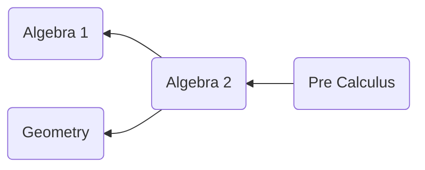

# Course Scheduler by Brandon Jurado

This program takes in information about courses and their prerequisites, and prints all the course names in prerequisite-satisfying order (such that the courses can be taken in exactly the order printed).

## Getting Started
### Prerequisites

* node
```
brew install node
```
### Usage
In order to run this program, you must provide a JSON file that follows the following structure:
```
[
	{
		"name": "Differential Equations",
		"prerequisites": ["Calculus"]
	},
	{
		"name": "Intro to Physics",
		"prerequisites": ["Scientific Thinking"]
	}
]
```
To run the program use either of the following commands:
* `./scheduler FILE_NAME` or 
* `node scheduler.js FILE_NAME`

## Graph Approach

Prerequisites visualized in a dependency graph

